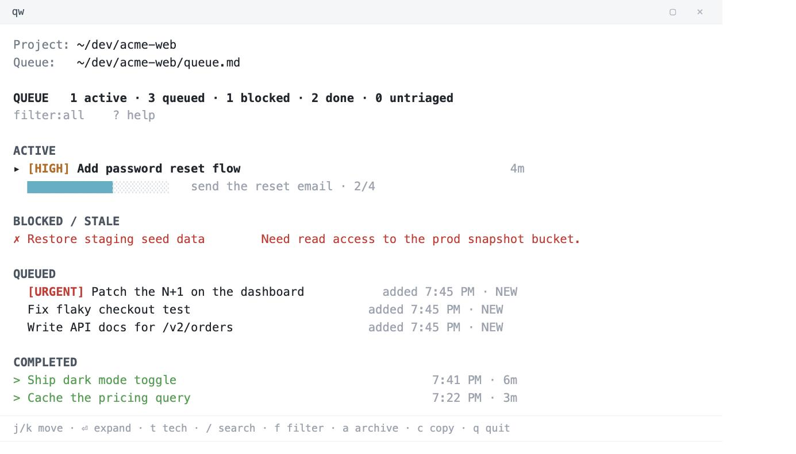
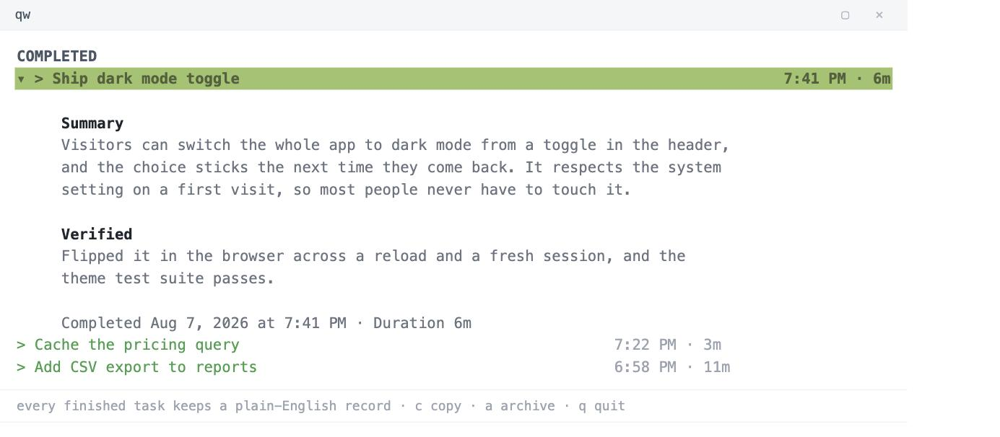

# Claude Queue

A persistent `TASKS.md` work queue for [Claude Code](https://claude.com/claude-code). It gives you a live terminal tracker, a prompt inbox that never drops a request, and a plain-English record of everything that gets finished. Type `/queue`, keep feeding it work, and watch it go in a second pane.

> Standard-library Python. No accounts, no services, no dependencies. Your queue is a plain `TASKS.md` file in your project.



---

## How this is different from an issue tracker

Issue trackers like Linear, Plane, or Jira manage the big picture: epics and issues you plan over days and weeks. Keep doing that where you already do it.

Claude Queue works at a different altitude. It lives inside a single Claude Code session, where you pound tasks into the agent as fast as you think of them. It keeps a running list so nothing you asked for gets dropped, and every finished task leaves a short note on what changed, so you can look back and see what actually got done.

The point is to stay in flow. You keep firing ideas at Claude instead of babysitting a checklist or scrolling back to figure out where things landed.

---

## What it does

- **`/queue` activates queue mode.** Claude works the list top-to-bottom, one task at a time, and doesn't stop until everything is done or explicitly blocked.
- **Keep typing.** Every prompt you send while it's working is captured to a lossless inbox and folded into the queue, so nothing gets dropped.
- **Honest progress.** Tasks break into substeps that get checked off *as they're completed*, not all at once at the end.
- **Readable history.** Each finished task stores a plain-English `Shipped —` / `Verified —` summary. Expand any completed task to read exactly what changed and how it was checked, or export the whole log.
- **Live tracker.** A curses TUI: active / queued / blocked / done, priority badges, search, filter, and per-task detail.
- **Crash-safe.** State is atomic and flock-protected, with an append-only event log it can rebuild from if anything gets corrupted.



## The tracker

Open the tracker in a second terminal pane. If you added the `qw` shortcut during install, that's all you type:

```
qw                            open the tracker for the current project
```

Under the hood `qw` is just `taskwatch TASKS.md`. The full command has a few modes:

```
taskwatch TASKS.md            interactive TUI
taskwatch TASKS.md --once     plain-text snapshot
taskwatch TASKS.md --json     JSON snapshot
taskwatch TASKS.md --export   Markdown completion log, newest first
taskwatch TASKS.md --doctor   installation & queue health checks
```

Keys: `j`/`k` move · `Enter` expand · `t` technical detail · `/` search · `f` filter · `a` archive · `c` copy summary · `q` quit.

---

## Install

**One-liner** (clones nothing permanent; copies the skill into `~/.claude`):

```bash
git clone https://github.com/dannygreer/claude-queue.git
cd claude-queue
./install.sh
```

The installer copies the skill to `~/.claude/skills/queue/`, the tracker to `~/.claude/bin/taskwatch`, and tells you if `~/.claude/bin` needs to go on your `PATH`. Re-run it any time to update.

**Verify:**

```bash
taskwatch --doctor      # or: ~/.claude/bin/taskwatch --doctor
```

### Requirements

- [Claude Code](https://claude.com/claude-code) running in a terminal (the CLI). The tracker is a terminal program you run in a second pane, so this is built for CLI use, not the Claude Code desktop or web app.
- Python 3.9+ (standard library only, nothing to `pip install`)
- macOS or Linux (uses `fcntl` file locking)

---

## Usage

In any project, start a session and run `/queue` followed by the work you want done:

```
/queue add the login bug, then the export feature, then update the changelog
```

Claude turns that into tasks and starts working. Open a second terminal pane to watch it live:

```bash
qw            # the shortcut, or the full form: taskwatch TASKS.md
```

Add more work at any time. Just type it, and it gets queued, not dropped.

The queue lives in `TASKS.md` at your project root. Tracker state lives in `.claude/taskwatch/` next to it (auto-excluded from Git via `.git/info/exclude`, so it never clutters your commits).

---

## How it works

Three Claude Code hooks, declared in the skill's `SKILL.md`:

| Hook | Script | Job |
|------|--------|-----|
| `UserPromptSubmit` | `prompt_capture.py` | Capture every prompt to the inbox so nothing is lost |
| `PostToolBatch` | `activity.py` | Record live activity for the tracker's progress signals |
| `Stop` | `check_queue.py` | Reconcile `TASKS.md` ↔ state, capture Shipped/Verified summaries, and refuse to end while actionable work or unacknowledged prompts remain |

All three share `queue_lib.py`, which also backs `taskwatch`. `TASKS.md` is the single source of truth; the `.claude/taskwatch/` state is a derived, rebuildable cache.

---

## Build it yourself

Prefer to grow your own version (or have Claude Code build it for you) instead of installing this one? The full design spec and a copy-paste build brief are in **[docs/BUILD.md](docs/BUILD.md)**: the architecture, the `TASKS.md` format, the hook contracts, and the invariants that keep it crash-safe.

---

## License

[MIT](LICENSE) © Danny Greer
